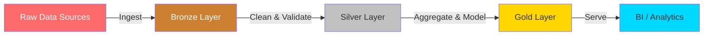

<div align="center">

<!-- ══════════════════════════════════════════════════════════════ -->
<!--                    ANIMATED BANNER HEADER                      -->
<!-- ══════════════════════════════════════════════════════════════ -->


<!-- Badges Row -->
<p>
  
  
  
  
  
</p>

<!-- Animated Typing SVG -->
<a href="https://git.io/typing-svg">
  
</a>

<br/>

<!-- Snake Animation -->
<picture>
  <source media="(prefers-color-scheme: dark)" srcset="https://raw.githubusercontent.com/Ksaisandeepkumar/Ksaisandeepkumar/output/github-snake-dark.svg" />
  <source media="(prefers-color-scheme: light)" srcset="https://raw.githubusercontent.com/Ksaisandeepkumar/Ksaisandeepkumar/output/github-snake.svg" />
  
</picture>

</div>

---

<!-- ══════════════════════════════════════════════════════════════ -->
<!--                       ABOUT ME SECTION                         -->
<!-- ══════════════════════════════════════════════════════════════ -->


##  About Me


```python
class SaiSandeepKommi:
    def __init__(self):
        self.name        = "Sai Sandeep Kommi"
        self.role        = "Senior Data Engineer"
        self.experience  = "5+ Years"
        self.location    = "United States 🇺🇸"
        self.languages   = ["Python", "SQL", "PySpark", "Bash", "YAML"]
        self.platforms   = ["Databricks", "Snowflake", "AWS", "Azure"]
        self.transforms  = ["dbt", "Spark", "Delta Lake", "Kafka"]
        self.orchestrate = ["Apache Airflow", "GitHub Actions", "Terraform"]
        self.databases   = ["Redshift", "Snowflake", "Delta", "PostgreSQL"]
        self.viz         = ["Power BI", "Tableau"]
        self.domains     = ["Healthcare", "Banking", "FinTech"]
        self.passions    = ["Lakehouse Architecture", "Data Mesh",
                            "Data Quality", "Dimensional Modeling"]

    def current_focus(self):
        return "Building enterprise-grade Lakehouse platforms on Databricks"

    def fun_fact(self):
        return "I believe clean data pipelines are an art form 🎨"

    def life_motto(self):
        return "Data is the new oil — but only if you refine it right. 🛢️"

me = SaiSandeepKommi()
print(me.current_focus())
```


---

<!-- ══════════════════════════════════════════════════════════════ -->
<!--                    SKILLS & TECH STACK                         -->
<!-- ══════════════════════════════════════════════════════════════ -->

##  Tech Stack & Tools

<div align="center">

### 🐍 Core Languages
<p>
  
  
  
  
  
  
</p>

### ⚡ Big Data & Streaming
<p>
  
  
  
  
  
  
</p>

### 🏔️ Cloud Data Platforms
<p>
  
  
  
  
  
</p>

### ☁️ AWS Ecosystem
<p>
  
  
  
  
  
  
  
</p>

### 🗄️ Databases & Storage
<p>
  
  
  
  
  
</p>

### 🔧 DevOps, IaC & CI/CD
<p>
  
  
  
  
  
  
  
</p>

### 📊 BI & Visualization
<p>
  
  
  
  
</p>

</div>


---

<!-- ══════════════════════════════════════════════════════════════ -->
<!--                  SKILLS PROFICIENCY BARS                       -->
<!-- ══════════════════════════════════════════════════════════════ -->

## 📈 Skill Proficiency

```text
Python / PySpark      ████████████████████  98%
SQL / dbt             ████████████████████  97%
Databricks            ███████████████████░  95%
Snowflake             ███████████████████░  94%
Apache Spark          ██████████████████░░  92%
Apache Airflow        ██████████████████░░  91%
AWS (S3/Glue/EMR)     █████████████████░░░  88%
Delta Lake            █████████████████░░░  87%
Kafka / Streaming     ████████████████░░░░  83%
Terraform / Docker    ███████████████░░░░░  79%
Power BI              ██████████████░░░░░░  73%
Kubernetes            ████████████░░░░░░░░  65%
```


---

<!-- ══════════════════════════════════════════════════════════════ -->
<!--                  DATA ENGINEERING EXPERTISE                    -->
<!-- ══════════════════════════════════════════════════════════════ -->

## 🏗️ Data Engineering Expertise

<div align="center">

| 🎯 Domain | 🔧 Stack | 📊 Level |
|-----------|---------|---------|
| **Lakehouse Architecture** | Databricks + Delta Lake + Unity Catalog | ⭐⭐⭐⭐⭐ |
| **Cloud Data Warehousing** | Snowflake + dbt + Airflow | ⭐⭐⭐⭐⭐ |
| **Batch ETL/ELT Pipelines** | PySpark + AWS Glue + S3 | ⭐⭐⭐⭐⭐ |
| **Real-time Streaming** | Kafka + Spark Structured Streaming | ⭐⭐⭐⭐☆ |
| **Dimensional Modeling** | Star Schema + Slowly Changing Dims | ⭐⭐⭐⭐⭐ |
| **Data Quality & Governance** | Great Expectations + dbt Tests | ⭐⭐⭐⭐☆ |
| **Infrastructure as Code** | Terraform + GitHub Actions + Docker | ⭐⭐⭐⭐☆ |
| **BI & Analytics** | Power BI + Tableau + Grafana | ⭐⭐⭐⭐☆ |

</div>


---

<!-- ══════════════════════════════════════════════════════════════ -->
<!--                    GITHUB STATISTICS                           -->
<!-- ══════════════════════════════════════════════════════════════ -->

##  GitHub Analytics

<div align="center">

<a href="https://github.com/Ksaisandeepkumar">
  
  
</a>

</div>

<div align="center">
  
</div>

<div align="center">
  
</div>


---

<!-- ══════════════════════════════════════════════════════════════ -->
<!--                    GITHUB TROPHIES                             -->
<!-- ══════════════════════════════════════════════════════════════ -->

## 🏆 GitHub Trophies

<div align="center">

[](https://github.com/ryo-ma/github-profile-trophy)

</div>


---

<!-- ══════════════════════════════════════════════════════════════ -->
<!--                  LEETCODE & COMPETITIVE                        -->
<!-- ══════════════════════════════════════════════════════════════ -->

## ⚔️ LeetCode Stats

<div align="center">

<a href="https://leetcode.com/u/saikommi474/">
  
</a>

</div>


---

<!-- ══════════════════════════════════════════════════════════════ -->
<!--                   FEATURED PROJECTS                            -->
<!-- ══════════════════════════════════════════════════════════════ -->

## 🚀 Featured Projects

<div align="center">

<a href="https://github.com/Ksaisandeepkumar/Data-Engineering-Portfolio">
  
</a>

</div>




---

<!-- ══════════════════════════════════════════════════════════════ -->
<!--                  WEEKLY CODING BREAKDOWN                       -->
<!-- ══════════════════════════════════════════════════════════════ -->

## ⏱️ This Week's Data Engineering Work

```text
🐍 Python / PySpark     ██████████████░░░░░░  68.4%
🔷 SQL / dbt            ████████░░░░░░░░░░░░  21.3%
📝 YAML / Config        ██░░░░░░░░░░░░░░░░░░   6.2%
🏗️ Terraform / IaC      █░░░░░░░░░░░░░░░░░░░   2.8%
📊 Notebooks            █░░░░░░░░░░░░░░░░░░░   1.3%
```


---

<!-- ══════════════════════════════════════════════════════════════ -->
<!--                    CONNECT WITH ME                             -->
<!-- ══════════════════════════════════════════════════════════════ -->

## 🌐 Connect With Me

<div align="center">

<a href="https://www.linkedin.com/in/sai-sandeep09" target="_blank">
  
</a>
<a href="https://leetcode.com/u/saikommi474/" target="_blank">
  
</a>
<a href="https://github.com/Ksaisandeepkumar" target="_blank">
  
</a>

</div>

<div align="center">

### 💬 Open to


</div>


---

<!-- ══════════════════════════════════════════════════════════════ -->
<!--                      FOOTER BANNER                             -->
<!-- ══════════════════════════════════════════════════════════════ -->

<div align="center">

### 💬 *"Data is the new oil — but only if you refine it right."*

**⭐ If you find my work useful, consider starring my repos!**


</div>
