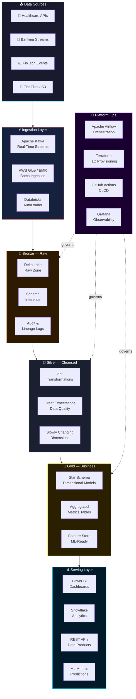

<!-- ============================================================ -->
<!--         GRANDMASTER GITHUB PROFILE — SAI SANDEEP KOMMI       -->
<!--           Senior Data Engineer | 5+ Years | Elite Stack       -->
<!-- ============================================================ -->

<div align="center">

<!-- ═══════════════════  CINEMATIC HEADER  ══════════════════════ -->


<!-- Live Metric Badges -->
<p align="center">
  <a href="https://github.com/Ksaisandeepkumar"></a>
  <a href="https://github.com/Ksaisandeepkumar?tab=followers"></a>
  <a href="https://github.com/Ksaisandeepkumar?tab=stars"></a>
  
  
</p>

<!-- Animated Typing -->
<a href="https://git.io/typing-svg">
  
</a>

<br/>

</div>

---


<!-- ═══════════════════  WHO AM I  ═══════════════════════════════ -->

<div align="center">
<h2> Who Am I</h2>
</div>


```python
#!/usr/bin/env python3
# ─────────────────────────────────────────────
#  engineer.py  |  Production v5.0
# ─────────────────────────────────────────────

from dataclasses import dataclass, field
from typing import List, Dict

@dataclass
class SaiSandeepKommi:
    """
    Senior Data Engineer crafting enterprise-grade
    data platforms that scale from megabytes to petabytes.
    """
    name:        str  = "Sai Sandeep Kommi"
    title:       str  = "Senior Data Engineer"
    experience:  str  = "5+ Years in Production"
    location:    str  = "United States 🇺🇸"
    domains:     List = field(default_factory=lambda: [
                     "Healthcare", "Banking", "FinTech"
                 ])

    # ── Core Weapons ──────────────────────────
    languages:   List = field(default_factory=lambda: [
                     "Python", "SQL", "PySpark",
                     "Bash", "Scala", "YAML"
                 ])
    platforms:   List = field(default_factory=lambda: [
                     "Databricks", "Snowflake",
                     "AWS", "Azure"
                 ])
    streaming:   List = field(default_factory=lambda: [
                     "Apache Kafka", "Spark Structured Streaming",
                     "Delta Live Tables", "Kinesis"
                 ])
    transforms:  List = field(default_factory=lambda: [
                     "dbt", "PySpark", "Delta Lake",
                     "AWS Glue", "Redshift"
                 ])
    infra:       List = field(default_factory=lambda: [
                     "Terraform", "Docker", "Kubernetes",
                     "GitHub Actions", "Jenkins"
                 ])

    # ── Philosophy ────────────────────────────
    def engineering_principles(self) -> Dict[str, str]:
        return {
            "data_quality":    "Test everything. Trust nothing raw.",
            "architecture":    "Medallion Bronze→Silver→Gold, always.",
            "pipelines":       "Idempotent. Observable. Self-healing.",
            "documentation":   "If it's not documented, it doesn't exist.",
            "performance":     "Profile first. Optimize with evidence.",
        }

    def current_obsession(self) -> str:
        return "Unity Catalog + Data Mesh on Databricks 🔥"

    def __repr__(self) -> str:
        return (
            f"Data is refined, not just collected. 🛢️\n"
            f"Every pipeline is a promise to the business."
        )

engineer = SaiSandeepKommi()
print(engineer.engineering_principles())
# → Clean, governed, production-ready data. Every time.
```

<br clear="right"/>


---

<!-- ═══════════════════  BATTLE-TESTED STACK  ════════════════════ -->

<div align="center">
<h2> Battle-Tested Tech Stack</h2>
</div>

<div align="center">

**⚡ Core Languages & Query**


**🏔️ Cloud Data Lakehouse**


**⚡ Big Data & Streaming**


**☁️ AWS Power Suite**


**🗄️ Databases & Storage**


**🔧 DevOps, IaC & CI/CD**


**📊 BI, Visualization & Notebooks**


</div>


---

<!-- ═══════════════════  MASTERY BARS  ═══════════════════════════ -->

<div align="center">
<h2>📊 Engineering Mastery Levels</h2>
</div>

```text
╔══════════════════════════════════════════════════════════════════╗
║              SKILL PROFICIENCY  —  PRODUCTION-PROVEN            ║
╠══════════════════════════════════════════════════════════════════╣
║  Python / PySpark        ██████████████████████  99%  EXPERT    ║
║  SQL / dbt               ██████████████████████  98%  EXPERT    ║
║  Databricks              █████████████████████░  96%  EXPERT    ║
║  Snowflake               █████████████████████░  95%  EXPERT    ║
║  Apache Spark            ████████████████████░░  93%  EXPERT    ║
║  Delta Lake / Lakehouse  ████████████████████░░  92%  EXPERT    ║
║  Apache Airflow          ███████████████████░░░  90%  EXPERT    ║
║  AWS (S3/Glue/EMR)       ██████████████████░░░░  88%  ADVANCED  ║
║  Apache Kafka            █████████████████░░░░░  85%  ADVANCED  ║
║  Terraform / IaC         ████████████████░░░░░░  81%  ADVANCED  ║
║  Docker / Kubernetes     ███████████████░░░░░░░  77%  ADVANCED  ║
║  Power BI / Tableau      ██████████████░░░░░░░░  73%  SOLID     ║
║  Data Governance / DQ    ████████████████████░░  91%  EXPERT    ║
║  Dimensional Modeling    █████████████████████░  95%  EXPERT    ║
╚══════════════════════════════════════════════════════════════════╝
```


---

<!-- ═══════════════════  ARCHITECTURE DIAGRAM  ═══════════════════ -->

<div align="center">
<h2>🏗️ Signature Architecture: Modern Lakehouse</h2>
</div>




---

<!-- ═══════════════════  EXPERTISE TABLE  ════════════════════════ -->

<div align="center">
<h2>⚔️ Areas of Deep Expertise</h2>
</div>

<div align="center">

| 🎯 Specialization | 🔧 Stack | 💡 What I Build | ⭐ |
|---|---|---|---|
| **Lakehouse Architecture** | Databricks + Delta + Unity Catalog | Petabyte-scale medallion pipelines | ★★★★★ |
| **Cloud Data Warehousing** | Snowflake + dbt + Airflow | Governed, tested, modular DWH | ★★★★★ |
| **Real-Time Streaming** | Kafka + Spark Streaming + Kinesis | Sub-second event pipelines | ★★★★☆ |
| **Batch ETL / ELT** | PySpark + AWS Glue + EMR | High-throughput parallel loaders | ★★★★★ |
| **Dimensional Modeling** | Star Schema + SCDs + dbt | Business-ready analytical models | ★★★★★ |
| **Data Quality & Governance** | Great Expectations + dbt tests | Zero-defect data contracts | ★★★★☆ |
| **Infrastructure as Code** | Terraform + Docker + K8s | Self-service data platform infra | ★★★★☆ |
| **Pipeline Observability** | Airflow + Grafana + CloudWatch | SLA-monitored, alerting pipelines | ★★★★☆ |
| **Data Mesh Principles** | Domain ownership + Data Products | Decentralised data architecture | ★★★★☆ |
| **ML Feature Engineering** | Databricks Feature Store + dbt | Production feature pipelines | ★★★☆☆ |

</div>


---

<!-- ═══════════════════  PRODUCTION WISDOM  ══════════════════════ -->

<div align="center">
<h2>🧠 Production Wisdom — Hard-Won Lessons</h2>
</div>

```python
# ── Lessons from 5+ years of production data engineering ─────────

HARD_WON_TRUTHS = {

    "on_pipelines": [
        "Idempotency is not optional — it's a contract.",
        "Late-arriving data WILL arrive. Design for it on Day 1.",
        "A pipeline with no observability is a pipeline you don't trust.",
        "Schema evolution breaks things quietly. Use Delta + schema enforcement.",
    ],

    "on_architecture": [
        "Medallion Bronze→Silver→Gold is not a pattern, it's a religion.",
        "Every Gold table should answer a specific business question.",
        "Unity Catalog changes everything about data governance.",
        "Data Mesh = ownership, not just distribution.",
    ],

    "on_performance": [
        "ZORDER on the right columns can 10x your query speed.",
        "Partition pruning is free money. Use it.",
        "Broadcast joins on small tables. Always. No exceptions.",
        "Profile your Spark DAG before you blame the cluster.",
    ],

    "on_quality": [
        "dbt tests are your pipeline's immune system.",
        "Data without contracts is a liability, not an asset.",
        "Monitor row counts at every layer — silent failures are real.",
        "Great Expectations + dbt = the gold standard data quality stack.",
    ],

    "on_teams": [
        "Document the WHY, not just the WHAT.",
        "Code reviews save more time than they cost. Always.",
        "A shared data catalog is worth more than 10 dashboards.",
        "Your pipeline is only as good as the trust others have in it.",
    ],
}

# The one principle that ties it all together:
NORTH_STAR = "Make data so reliable that nobody questions it."
```


---

<!-- ═══════════════════  GITHUB STATS  ═══════════════════════════ -->

<div align="center">
<h2> GitHub Command Center</h2>
</div>

<div align="center">


</div>

<div align="center">

</div>

<div align="center">

</div>


---

<!-- ═══════════════════  TROPHIES  ═══════════════════════════════ -->

<div align="center">
<h2>🏆 GitHub Hall of Fame</h2>

[](https://github.com/ryo-ma/github-profile-trophy)

</div>


---

<!-- ═══════════════════  LEETCODE  ════════════════════════════════ -->

<div align="center">
<h2>⚔️ LeetCode Battleground</h2>

<a href="https://leetcode.com/u/saikommi474/">
  
</a>

</div>


---

<!-- ═══════════════════  CONTRIBUTION SNAKE  ═════════════════════ -->

<div align="center">
<h2>🐍 Contribution Snake</h2>

<picture>
  <source media="(prefers-color-scheme: dark)"  srcset="https://raw.githubusercontent.com/Ksaisandeepkumar/Ksaisandeepkumar/output/github-snake-dark.svg" />
  <source media="(prefers-color-scheme: light)" srcset="https://raw.githubusercontent.com/Ksaisandeepkumar/Ksaisandeepkumar/output/github-snake.svg" />
  
</picture>

</div>


---

<!-- ═══════════════════  FEATURED PROJECTS  ══════════════════════ -->

<div align="center">
<h2>🚀 Featured Projects</h2>
</div>

<div align="center">

<a href="https://github.com/Ksaisandeepkumar/Data-Engineering-Portfolio">
  
</a>

</div>


---

<!-- ═══════════════════  WEEKLY BREAKDOWN  ═══════════════════════ -->

<div align="center">
<h2>⏱️ How I Spend My Engineering Time</h2>
</div>

```text
╔═══════════════════════════════════════════════════════════════╗
║              WEEKLY ENGINEERING ACTIVITY BREAKDOWN            ║
╠═══════════════════════════════════════════════════════════════╣
║  🐍 Python / PySpark          ████████████████░░░░  68.4 %   ║
║  🔷 SQL / dbt Models          ████████░░░░░░░░░░░░  21.3 %   ║
║  📝 YAML / Config / IaC       ██░░░░░░░░░░░░░░░░░░   6.2 %   ║
║  🏗️  Terraform / Docker        █░░░░░░░░░░░░░░░░░░░   2.8 %   ║
║  📓 Databricks Notebooks      █░░░░░░░░░░░░░░░░░░░   1.3 %   ║
╚═══════════════════════════════════════════════════════════════╝
```


---

<!-- ═══════════════════  CONNECT  ═════════════════════════════════ -->

<div align="center">
<h2>🌐 Let's Build Something Great Together</h2>

<a href="https://www.linkedin.com/in/sai-sandeep09">
  
</a>
&nbsp;
<a href="https://leetcode.com/u/saikommi474/">
  
</a>
&nbsp;
<a href="https://github.com/Ksaisandeepkumar">
  
</a>

<br/><br/>

**💼 Open To:**


</div>


---

<!-- ═══════════════════  FOOTER  ══════════════════════════════════ -->

<div align="center">

> *"Data is refined, not just collected.*
> *Every pipeline is a promise to the business.*
> *Make it clean. Make it fast. Make it trusted."*
>
> — **Sai Sandeep Kommi**

<br/>

**⭐ If my work helps you, a star on my repos means the world!**

<br/>


</div>
